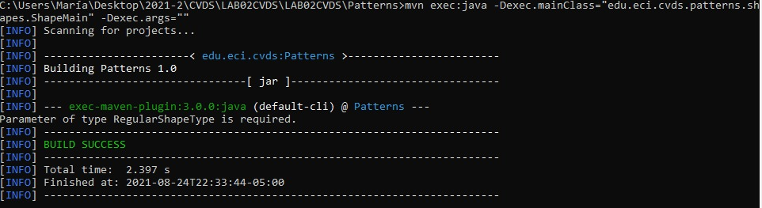
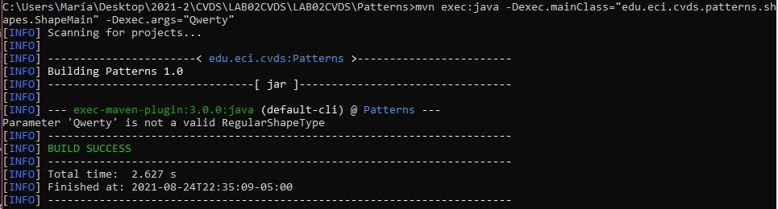
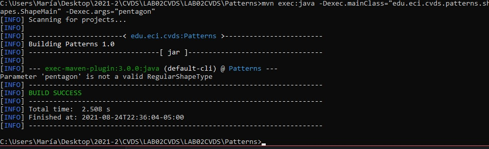
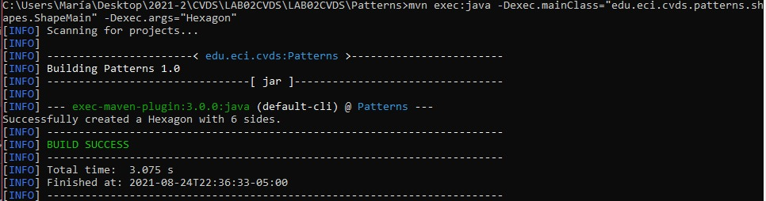

# LAB02

## Cuál es su mayor utilidad

El manejo de proyectos y el empaquetamiento de estos mismos

## Fases de Maven 

Install, Run, Configure, IDE Integration

## Ciclo de vida de construcción

1. Compile
2. Package
3. Install
4. Deploy

## Para qué sirven los plugins

Son complementos de código que contienen un grupo de funciones o características

## Qué es y para qué sirve el repositorio central de Maven

Es un repositorio en el cual se encuentran varias dependencias para poder integrar en un proyecto 

## Busque cuál es el objetivo del parametro package y qué otros parámetros se podrían enviar al comando mvn

Toma el código compilado y lo empaqueta en un formato distribuible, como un JAR

## COMPILAR Y EJECUTAR

 
 
 

## HACER EL ESQUELETO DE LA APLICACION

### Probando las instrucciones

**Sin parámetros** 

 

No funciona ya que entra al condicional que evalua cuando los argumentos del método son null o tienen una longitud mayor a 1

**Qwerty**

 

No funciona ya que "Qwerty" no  es del tipo de los elementos declarados RegularShapeType

**Pentagon**

 

No funciona ya que "pentagon" no es del tipo de los elementos declarados RegularShapeType, porque la "p" no está en mayúscula

**Hexagon**

 

Si funciona ya que "Hexagon" es del tipo de los elementos declarados RegularShapeType

## .gitignore

Es un archivo de texto que sirve para indicarle a Git qué archivos o carpetas se deben ignorar en un proyecto

